# Analysis and Prediction of Workplace Burnout

## Backstory
It's no secret that in the United States of America, you must work in some way to support yourself and/or your loved ones. Some love their jobs while others despise them due to a number of reasons. One of the most common occurances is burnout, in which an idividual works so hard that they become overworked and cannot properly function to their best. This has become especially prominent in the times of the Corona Virus. We took a look at a dataset that provided infromation about employees including:
- Date of Joining Work
- Gender
- Company Type
- Work From Home Setup Avaoilable
- Designation
- Resource Allocation
- Mental Fatigue Score
- Burn Rate

Using this data, we were able to understand the contributing factors to employee burnout and build a prediction model.

## Data Analysis

#### Gender Count
This graph depicts the count of male and females that have participated in this dataset:
- 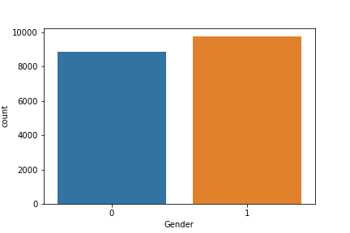

#### Work From Home Setup
- This bar chart shows how many employees are able to work from home:
- 

#### Company Type
- This bar chart counts the amount of employees who work in product vs service companies:
- 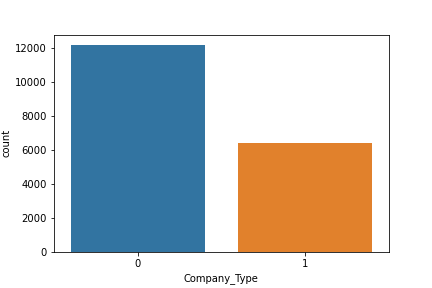

#### Mental Fatigue Score
- This chart showcase the range of employee Mental Fatigue:
- 

#### Burnout Rate
- This chart showcase the range of employee Burnout:
- 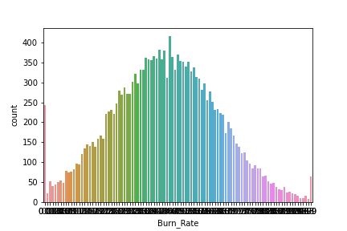

#### Linear Regression: Mental Fatigue Score vs Resource Allocation
- The chart is utlizing a linear regression model that compares mental fatigue to the amount of resources an employee has:
- 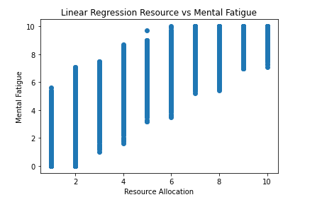

#### Linear Regression: Burnout Rate vs Mental Fatigue Score
- The chart is utlizing a linear regression model that compares the burn rate to the amount of resources an employee has:
- 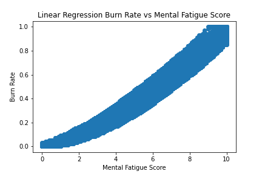

#### Linear Regression: Burnout Rate vs Resource Allocation
- The chart is utlizing a linear regression model that compares mental fatigue score to the burn rate of the employees:
- 

## Data Prediction Model

#### Building the Model
- 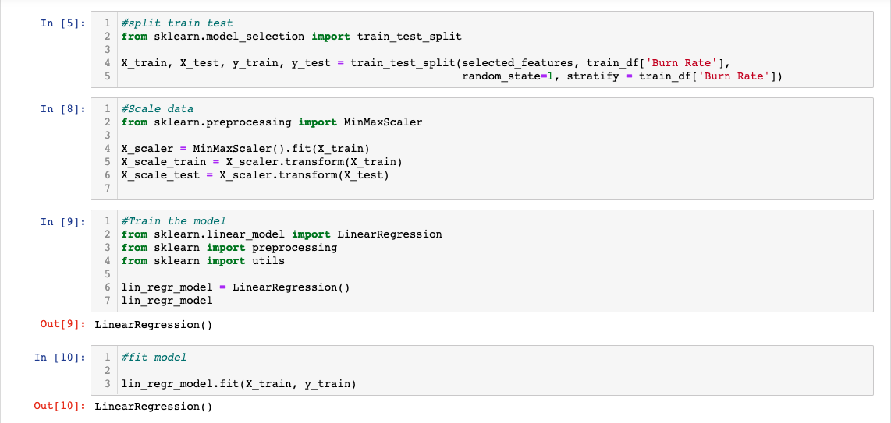
- We started by splitting the data with the Train Test Split function and scaling the data. We used a linear regression model and fit the training data.

#### Train & Test Scores
- 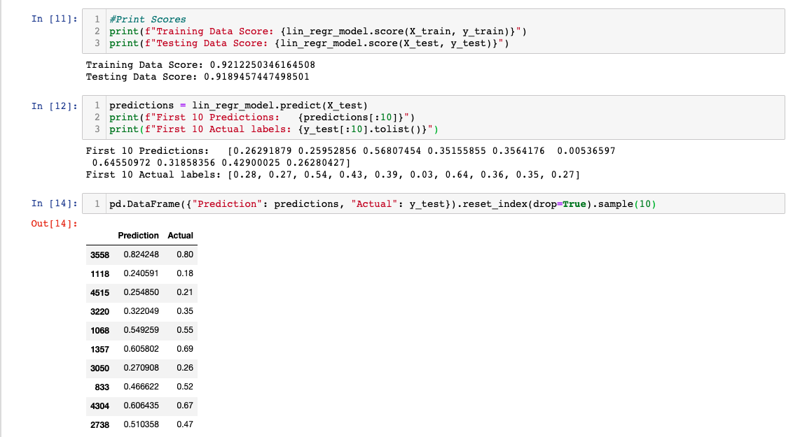
- We ran the train and test scores to see how our model was performing. The high test scores were concerning but we proceeded to run predictions to examine the model’s accuracy.

#### Support Vector Regression
- 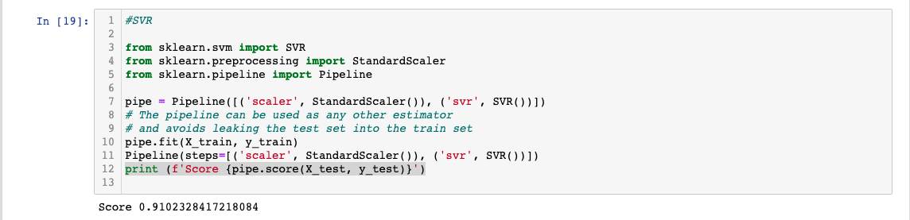
- We ran a Support Vector Regression (SVR) to compare the model scores. The scores were close enough to reinforce that the model was working correctly.

#### Random Forest
- 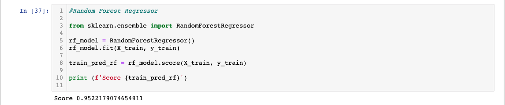
- Lastly, we ran a Random Forest Regressor to triple check that the model was working correctly. The last score reinforced that the model was truly working.

#### Save, Load, & Predict
- 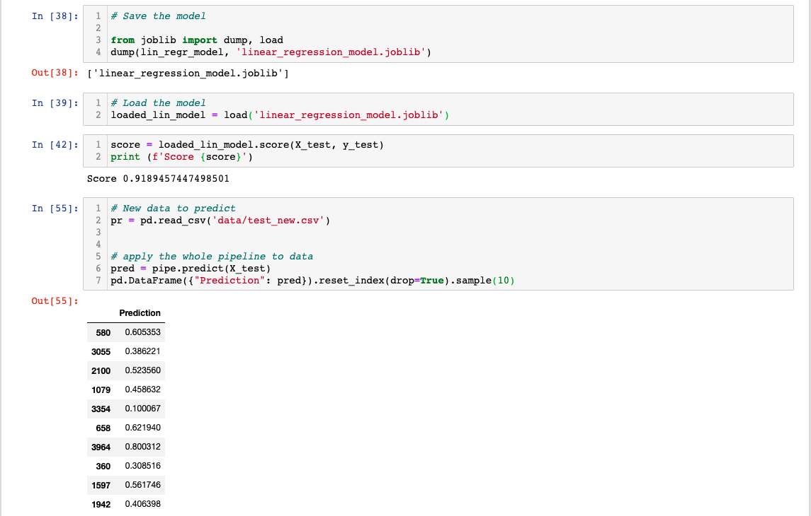
- Now that we were sure the model was working correctly, we saved the model and loaded it back into our notebook. We evaluated the model’s score and ran a file with new data to test the predictions.

#### Testing New Data
- 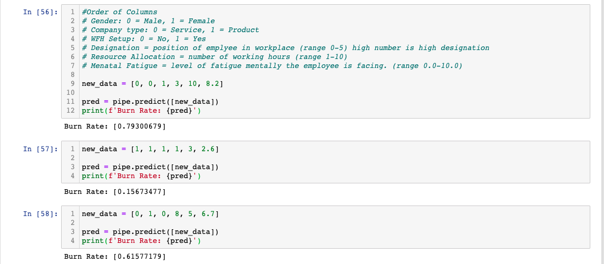
- We plugged in random data to make sure that the model would predict a different Burn Rate based on the inputs.

#### User Input
- 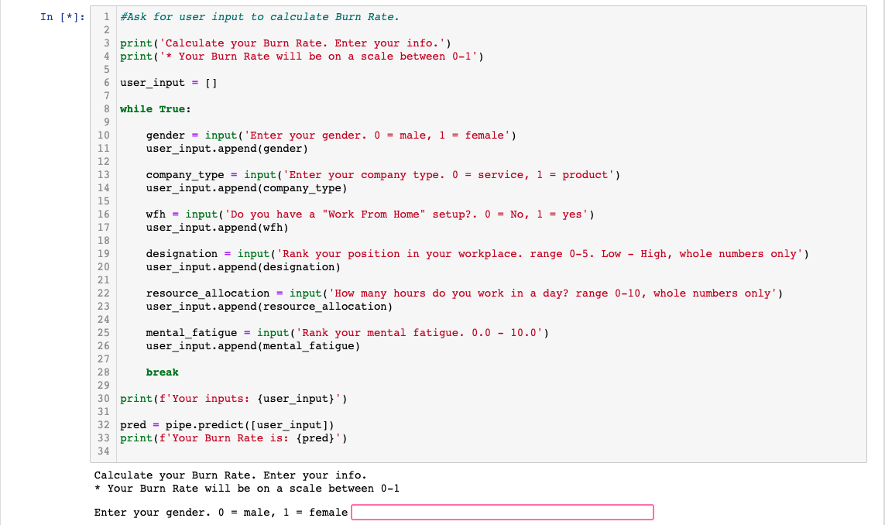
- We put together a loop that would take a user’s inputs and generate their Burn Rate.