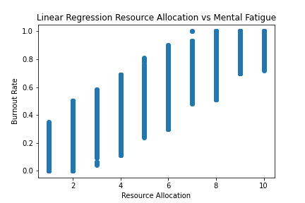

# Analysis and Prediction of Workplace Burnout

## Backstory
It's no secret that in the United States of America, you must work in some way to support yourself and/or your loved ones. Some love their jobs while others despise them due to a number of reasons. One of the most common occurances in is burnout, in which an idividual works so hard that they become overworked and cannot properly function to their best. We took a look at a dataset that provided infromation about employees including:
- Date of Joining Work
- Gender
- Company Type
- Work From Home Setup Avaoilable
- Designation
- Resource Allocation
- Mental Fatigue Score
- Burn Rate

Using this data, we were able to understand the contributing factors to employee burnout.

## Analysis
### Gender Count:

### Work From Home:

### Company Type:

### Mental Fatigue:

### Burn Rate:

### Linear Regression: Mental Fatigue Score vs Resource Allocation

### Linear Regression: Burn Rate vs Mental Fatigue Score

### Linear Regreesion: Burn Rate vs Resource Allocation
